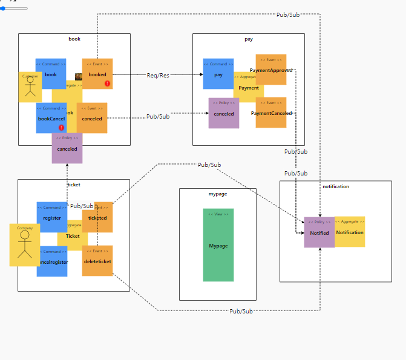

# 예제 -  티켓예매서비스

- 체크포인트 : https://workflowy.com/s/assessment-check-po/T5YrzcMewfo4J6LW


# Table of contents

- [예제 - 티켓예매서비스](#---)
    - [서비스 시나리오](#서비스-시나리오)
    - [체크포인트](#체크포인트)
    - [분석/설계](#분석설계)
    - [구현:](#구현-)
        - [DDD 의 적용](#ddd-의-적용)
        - [폴리글랏 퍼시스턴스](#폴리글랏-퍼시스턴스)
        - [폴리글랏 프로그래밍](#폴리글랏-프로그래밍)
        - [동기식 호출 과 Fallback 처리](#동기식-호출-과-Fallback-처리)
        - [비동기식 호출 과 Eventual Consistency](#비동기식-호출-과-Eventual-Consistency)
    - [운영](#운영)
        - [CI/CD 설정](#cicd설정)
        - [동기식 호출 / 서킷 브레이킹 / 장애격리](#동기식-호출-서킷-브레이킹-장애격리)
        - [오토스케일 아웃](#오토스케일-아웃)
        - [무정지 재배포](#무정지-재배포)
        - [ConfigMap 사용](#ConfigMap-사용)
        - [Self-healing (Liveness Probe)](#Self-healing-Liveness-Probe)
        - [CQRS](#CQRS)
    - [신규 개발 조직의 추가](#신규-개발-조직의-추가)

# 서비스 시나리오

티켓 예매 서비스 따라하기

기능적 요구사항
1. 주최사가 티켓을 등록한다.
1. 주최사가 티켓을 삭제한다.
3. 구매자가 티켓을 검색한다.
4. 구매자가 티켓을 선택하여 사용 예매한다.
5. 구매자가 결제한다. (Sync, 결제서비스)
6. 결제가 완료되면, 결제 & 예매 내용을 구매자에게 알림을 전송한다. (Async, 알림서비스)
7. 예매 내역을 주최사에게 전달한다.
8. 구매자는 본인의 예매 내용 및 상태를 조회한다.
9. 구매자는 본인의 예매을 취소할 수 있다.
12. 예매이 취소되면, 결제를 취소한다. (Async, 결제서비스)
13. 결제가 취소되면, 결제 취소 내용을 구매자에게 알림을 전송한다. (Async, 알림서비스)
14. 티켓이 삭제 된다면, 예매도 취소된다.
15. 티켓 삭제, 생성 시 주최사에게 알림을 전송한다. (Async, 알림서비스)


비기능적 요구사항
1. 트랜잭션
    1. 결제가 되지 않은 예매건은 아예 거래가 성립되지 않아야 한다 - Sync 호출
1. 장애격리
    1. 통지(알림) 기능이 수행되지 않더라도 예매은 365일 24시간 받을 수 있어야 한다 - Async (event-driven), Eventual Consistency
    1. 결제시스템이 과중되면 사용자를 잠시동안 받지 않고 결제를 잠시후에 하도록 유도한다 - Circuit breaker, fallback
1. 성능
    1. 구매자와 주최사가 자주 예매관리에서 확인할 수 있는 상태를 마이페이지(프론트엔드)에서 확인할 수 있어야 한다 - CQRS
    1. 처리상태가 바뀔때마다 email, app push 등으로 알림을 줄 수 있어야 한다 - Event driven


# 체크포인트

- 분석 설계


- 이벤트스토밍:
    - 스티커 색상별 객체의 의미를 제대로 이해하여 헥사고날 아키텍처와의 연계 설계에 적절히 반영하고 있는가?
    - 각 도메인 이벤트가 의미있는 수준으로 정의되었는가?
    - 어그리게잇: Command와 Event 들을 ACID 트랜잭션 단위의 Aggregate 로 제대로 묶었는가?
    - 기능적 요구사항과 비기능적 요구사항을 누락 없이 반영하였는가?

- 서브 도메인, 바운디드 컨텍스트 분리
    - 팀별 KPI 와 관심사, 상이한 배포주기 등에 따른  Sub-domain 이나 Bounded Context 를 적절히 분리하였고 그 분리 기준의 합리성이 충분히 설명되는가?
        - 적어도 3개 이상 서비스 분리
    - 폴리글랏 설계: 각 마이크로 서비스들의 구현 목표와 기능 특성에 따른 각자의 기술 Stack 과 저장소 구조를 다양하게 채택하여 설계하였는가?
    - 서비스 시나리오 중 ACID 트랜잭션이 크리티컬한 Use 케이스에 대하여 무리하게 서비스가 과다하게 조밀히 분리되지 않았는가?
- 컨텍스트 매핑 / 이벤트 드리븐 아키텍처
    - 업무 중요성과  도메인간 서열을 구분할 수 있는가? (Core, Supporting, General Domain)
    - Request-Response 방식과 이벤트 드리븐 방식을 구분하여 설계할 수 있는가?
    - 장애격리: 서포팅 서비스를 제거 하여도 기존 서비스에 영향이 없도록 설계하였는가?
    - 신규 서비스를 추가 하였을때 기존 서비스의 데이터베이스에 영향이 없도록 설계(열려있는 아키택처)할 수 있는가?
    - 이벤트와 폴리시를 연결하기 위한 Correlation-key 연결을 제대로 설계하였는가?

- 헥사고날 아키텍처
    - 설계 결과에 따른 헥사고날 아키텍처 다이어그램을 제대로 그렸는가?

- 구현
    - [DDD] 분석단계에서의 스티커별 색상과 헥사고날 아키텍처에 따라 구현체가 매핑되게 개발되었는가?
        - Entity Pattern 과 Repository Pattern 을 적용하여 JPA 를 통하여 데이터 접근 어댑터를 개발하였는가
        - [헥사고날 아키텍처] REST Inbound adaptor 이외에 gRPC 등의 Inbound Adaptor 를 추가함에 있어서 도메인 모델의 손상을 주지 않고 새로운 프로토콜에 기존 구현체를 적응시킬 수 있는가?
        - 분석단계에서의 유비쿼터스 랭귀지 (업무현장에서 쓰는 용어) 를 사용하여 소스코드가 서술되었는가?
    - Request-Response 방식의 서비스 중심 아키텍처 구현
        - 마이크로 서비스간 Request-Response 호출에 있어 대상 서비스를 어떠한 방식으로 찾아서 호출 하였는가? (Service Discovery, REST, FeignClient)
        - 서킷브레이커를 통하여  장애를 격리시킬 수 있는가?
    - 이벤트 드리븐 아키텍처의 구현
        - 카프카를 이용하여 PubSub 으로 하나 이상의 서비스가 연동되었는가?
        - Correlation-key:  각 이벤트 건 (메시지)가 어떠한 폴리시를 처리할때 어떤 건에 연결된 처리건인지를 구별하기 위한 Correlation-key 연결을 제대로 구현 하였는가?
        - Message Consumer 마이크로서비스가 장애상황에서 수신받지 못했던 기존 이벤트들을 다시 수신받아 처리하는가?
        - Scaling-out: Message Consumer 마이크로서비스의 Replica 를 추가했을때 중복없이 이벤트를 수신할 수 있는가
        - CQRS: Materialized View 를 구현하여, 타 마이크로서비스의 데이터 원본에 접근없이(Composite 서비스나 조인SQL 등 없이) 도 내 서비스의 화면 구성과 잦은 조회가 가능한가?

    - 폴리글랏 플로그래밍
        - 각 마이크로 서비스들이 하나이상의 각자의 기술 Stack 으로 구성되었는가?
        - 각 마이크로 서비스들이 각자의 저장소 구조를 자율적으로 채택하고 각자의 저장소 유형 (RDB, NoSQL, File System 등)을 선택하여 구현하였는가?
    - API 게이트웨이
        - API GW를 통하여 마이크로 서비스들의 집입점을 통일할 수 있는가?
        - 게이트웨이와 인증서버(OAuth), JWT 토큰 인증을 통하여 마이크로서비스들을 보호할 수 있는가?
- 운영
    - SLA 준수
        - 셀프힐링: Liveness Probe 를 통하여 어떠한 서비스의 health 상태가 지속적으로 저하됨에 따라 어떠한 임계치에서 pod 가 재생되는 것을 증명할 수 있는가?
        - 서킷브레이커, 레이트리밋 등을 통한 장애격리와 성능효율을 높힐 수 있는가?
        - 오토스케일러 (HPA) 를 설정하여 확장적 운영이 가능한가?
        - 모니터링, 앨럿팅:
    - 무정지 운영 CI/CD (10)
        - Readiness Probe 의 설정과 Rolling update을 통하여 신규 버전이 완전히 서비스를 받을 수 있는 상태일때 신규버전의 서비스로 전환됨을 siege 등으로 증명
        - Contract Test :  자동화된 경계 테스트를 통하여 구현 오류나 API 계약위반를 미리 차단 가능한가?


# 분석/설계


## AS-IS 조직 (Horizontally-Aligned)


## TO-BE 조직 (Vertically-Aligned)


### 이벤트 도출


### 부적격 이벤트 탈락


    - 과정중 도출된 잘못된 도메인 이벤트들을 걸러내는 작업을 수행함
        - 티켓검색됨, 예매정보조회됨 :  UI 의 이벤트이지, 업무적인 의미의 이벤트가 아니라서 제외

### 액터, 커맨드 부착하여 읽기 좋게


### 어그리게잇으로 묶기


    - 티켓, 예매관리, 결제는 그와 연결된 command 와 event 들에 의하여 트랜잭션이 유지되어야 하는 단위로 그들 끼리 묶어줌

### 바운디드 컨텍스트로 묶기


    - 도메인 서열 분리 
        - Core Domain:  티켓, 예매 : 없어서는 안될 핵심 서비스이며, 연견 Up-time SLA 수준을 99.999% 목표, 배포주기는 1주일 1회 미만
        - Supporting Domain:   알림, 마이페이지 : 경쟁력을 내기위한 서비스이며, SLA 수준은 연간 60% 이상 uptime 목표, 배포주기는 각 팀의 자율이나 표준 스프린트 주기가 1주일 이므로 1주일 1회 이상을 기준으로 함.
        - General Domain:   결제 : 결제서비스로 3rd Party 외부 서비스를 사용하는 것이 경쟁력이 높음 (핑크색으로 이후 전환할 예정)

### 폴리시 부착 (괄호는 수행주체, 폴리시 부착을 둘째단계에서 해놔도 상관 없음. 전체 연계가 초기에 드러남)


### 기능적/비기능적 요구사항을 커버하는지 검증
링크 : http://www.msaez.io/#/storming/WpY4xioLpHPrZpRPBibQCIH6sv53/75cdb8abd599ef505adbe4df05122d25


    - (ok) 주최사가 티켓을 등록한다.
    - (ok) 주최사가 티켓을 삭제한다.
    - (ok) 주최사가 티켓을 삭제 시 예매 취소
    - (ok) 각 이벤트가 알림으로 전달 (Async, 알림 서비스)

    - (ok) 구매자가 티켓을 검색한다.
    - (ok) 구매자가 티켓을 선택하여 예매한다.
    - (ok) 구매자가 결제한다. (Sync, 결제서비스)
    - (ok) 결제가 완료되면, 결제 & 예매 내용을 구매자에게 알림을 전송한다. (Async, 알림서비스)
    - (ok) 예매 내역을 주최사에게 전달한다.
    
    - (ok) 구매자는 본인의 예매 내용 및 상태를 조회한다.
    - (ok) 구매자는 본인의 예매을 취소할 수 있다.
    - (ok) 예매이 취소되면, 결제를 취소한다. (Async, 결제서비스)
    - (ok) 결제가 취소되면, 결제 취소 내용을 구매자에게 알림을 전송한다. (Async, 알림서비스)

### 비기능 요구사항에 대한 검증


    - 마이크로 서비스를 넘나드는 시나리오에 대한 트랜잭션 처리
        - 티켓 예매시 결제처리: 결제가 완료되지 않은 예매은 절대 받지 않는다에 따라, ACID 트랜잭션 적용. 예매 완료시 결제처리에 대해서는 Request-Response 방식 처리
        - 예매 완료시 알림 처리: 예매에서 알림 마이크로서비스로 예매 완료 내용이 전달되는 과정에 있어서 알림 마이크로서비스가 별도의 배포주기를 가지기 때문에 Eventual Consistency 방식으로 트랜잭션 처리함.
        - 나머지 모든 inter-microservice 트랜잭션: 예매상태, 예매취소 등 모든 이벤트에 대해 알림 처리하는 등, 데이터 일관성의 시점이 크리티컬하지 않은 모든 경우가 대부분이라 판단, Eventual Consistency 를 기본으로 채택함.


## 헥사고날 아키텍처 다이어그램 도출


    - Chris Richardson, MSA Patterns 참고하여 Inbound adaptor와 Outbound adaptor를 구분함
    - 호출관계에서 PubSub 과 Req/Resp 를 구분함
    - 서브 도메인과 바운디드 컨텍스트의 분리:  각 팀의 KPI 별로 아래와 같이 관심 구현 스토리를 나눠가짐


# 구현:

분석/설계 단계에서 도출된 헥사고날 아키텍처에 따라, 각 BC별로 대변되는 마이크로 서비스들을 스프링부트로 구현하였다. 배포는 아래와 같이 수행한다.

```
# eks cluster 생성
eksctl create cluster --name user08-eks --version 1.17 --nodegroup-name standard-workers --node-type t3.medium --nodes 4 --nodes-min 1 --nodes-max 4

# eks cluster 설정
aws eks --region ap-northeast-1 update-kubeconfig --name user08-eks
kubectl config current-context

# metric server 설치
kubectl apply -f https://github.com/kubernetes-sigs/metrics-server/releases/download/v0.3.6/components.yaml

# Helm 설치
curl https://raw.githubusercontent.com/helm/helm/master/scripts/get-helm-3 > get_helm.sh
chmod 700 get_helm.sh
./get_helm.sh
(Helm 에게 권한을 부여하고 초기화)
kubectl --namespace kube-system create sa tiller
kubectl create clusterrolebinding tiller --clusterrole cluster-admin --serviceaccount=kube-system:tiller
helm init --service-account tiller

# Kafka 설치
helm repo update
helm repo add bitnami https://charts.bitnami.com/bitnami
kubectl create ns kafka
helm install my-kafka bitnami/kafka --namespace kafka

# myticket namespace 생성
kubectl create namespace myticket

# myticket image build & push
cd myticket/book
mvn package
docker build -t 740569282574.dkr.ecr.ap-northeast-1.amazonaws.com/book:latest .
docker push 740569282574.dkr.ecr.ap-northeast-1.amazonaws.com/book:latest

# myticket deploy
cd myticket/yaml
kubectl apply -f configmap.yaml
kubectl apply -f gateway.yaml
kubectl apply -f ticket.yaml
kubectl apply -f books.yaml
kubectl apply -f pay.yaml
kubectl apply -f mypage.yaml
kubectl apply -f notification.yaml
kubectl apply -f siege.yaml
```

현황
```
kubectl get all -n myticket

NAME                           READY   STATUS             RESTARTS   AGE
pod/alarm-b6bcd7c85-hbvk8      1/2     ImagePullBackOff   0          7m31s
pod/book-dfb68974-pz2dz        2/2     Running            0          28m
pod/gateway-59d958698c-h6h7s   1/1     Running            27         7h43m
pod/mypage-7478db866b-vjkvz    1/1     Running            28         7h34m
pod/pay-5996ffc64c-wdwlf       1/1     Running            28         7h36m
pod/siege                      1/1     Running            0          7h31m
pod/ticket-7448fdb5fc-2z6fg    1/1     Running            28         7h41m

NAME              TYPE           CLUSTER-IP       EXTERNAL-IP                                                                    PORT(S)          AGE
service/alarm     ClusterIP      10.100.160.224   <none>                                                                         8080/TCP         7m31s
service/book      ClusterIP      10.100.101.198   <none>                                                                         8080/TCP         28m
service/gateway   LoadBalancer   10.100.140.36    a7d38c203087b4d7aab621fac3aced69-1280573361.ap-northeast-1.elb.amazonaws.com   8080:30976/TCP   7h43m
service/mypage    ClusterIP      10.100.83.32     <none>                                                                         8080/TCP         7h34m
service/pay       ClusterIP      10.100.193.61    <none>                                                                         8080/TCP         7h36m
service/ticket    ClusterIP      10.100.176.107   <none>                                                                         8080/TCP         7h41m

NAME                      READY   UP-TO-DATE   AVAILABLE   AGE
deployment.apps/alarm     0/1     1            0           7m32s
deployment.apps/book      1/1     1            1           28m
deployment.apps/gateway   1/1     1            1           7h43m
deployment.apps/mypage    1/1     1            1           7h34m
deployment.apps/pay       1/1     1            1           7h36m
deployment.apps/ticket    1/1     1            1           7h41m

NAME                                 DESIRED   CURRENT   READY   AGE
replicaset.apps/alarm-b6bcd7c85      1         1         0       7m32s
replicaset.apps/book-dfb68974        1         1         1       28m
replicaset.apps/gateway-59d958698c   1         1         1       7h43m
replicaset.apps/mypage-7478db866b    1         1         1       7h34m
replicaset.apps/pay-5996ffc64c       1         1         1       7h36m
replicaset.apps/pay-5c85f5cb97       0         0         0       7h32m
replicaset.apps/ticket-7448fdb5fc    1         1         1       7h41m
```

```
kubectl get ns

NAME              STATUS   AGE
default           Active   15h
istio-system      Active   9h
kafka             Active   13h
kube-node-lease   Active   15h
kube-public       Active   15h
kube-system       Active   15h
myticket          Active   13h


```

```
Name:         myticket
Labels:       istio-injection=enabled
Annotations:  <none>
Status:       Active

No resource quota.

```


## DDD 의 적용

- 각 서비스내에 도출된 핵심 Aggregate Root 객체를 Entity 로 선언하였다: (예시는 book 마이크로 서비스). 이때 가능한 현업에서 사용하는 언어 (유비쿼터스 랭귀지)를 그대로 사용하려고 노력했다.

```
package com.example.rumypage;

import javax.persistence.*;
import java.util.List;
import java.util.Date;

@Entity
@Table(name="customerManagementPage_table")
public class CustomerManagementPage {

        @Id
        @GeneratedValue(strategy=GenerationType.AUTO)
        private Long id;
        private Long bookId;
        private Integer price;
        private Date startTime;
        private Date endTime;
        private Long ticketId;
        private String status;
        private Long payId;
        private Long conertId;
        private Long companyId;

    ...

}


```
- Entity Pattern 과 Repository Pattern 을 적용하여 JPA 를 통하여 다양한 데이터소스 유형 (RDB or NoSQL) 에 대한 별도의 처리가 없도록 데이터 접근 어댑터를 자동 생성하기 위하여 Spring Data REST 의 RestRepository 를 적용하였다
```
package com.example.rumyticket;

import org.springframework.data.repository.PagingAndSortingRepository;
import org.springframework.data.rest.core.annotation.RepositoryRestResource;

@RepositoryRestResource(collectionResourceRel="tickets", path="tickets")
public interface TicketRepository extends PagingAndSortingRepository<Ticket, Long>{
}

```
- 적용 후 REST API 의 테스트
```
# 티켓 등록처리
http POST http://ticket:8080/tickets price=15000 companyId=1

# 결과
Content-Type: application/json;charset=UTF-8
Date: Mon, 12 Jul 2021 22:53:05 GMT
Location: http://ticket:8080/tickets/6
Transfer-Encoding: chunked

{
    "_links": {
        "self": {
            "href": "http://ticket:8080/tickets/6"
        },
        "ticket": {
            "href": "http://ticket:8080/tickets/6"
        }
    },
    "price": 15000
}

```

```
# 예매처리
http POST http://book:8080/books startDate="2012-04-23T18:25:43.511+0000" endDate="2012-04-27T18:25:43.511+0000" customerId=1 companyId=1 ticketId=2 price=15000

# 결과

content-type: application/json;charset=UTF-8
date: Mon, 12 Jul 2021 22:53:56 GMT
location: http://book:8080/books/2
server: istio-envoy
transfer-encoding: chunked
x-envoy-decorator-operation: book.myticket.svc.cluster.local:8080/*
x-envoy-upstream-service-time: 1900

{
    "_links": {
        "book": {
            "href": "http://book:8080/books/2"
        },
        "self": {
            "href": "http://book:8080/books/2"
        }
    },
    "companyId": 1,
    "customerId": 1,
    "endDate": "2012-04-27T18:25:43.511+0000",
    "price": 15000,
    "startDate": "2012-04-23T18:25:43.511+0000",
    "status": null,
    "ticketId": 2
}

```
```
# 예매 상태 확인
http http://book:8080/books/1

# 결과
(아직 결제는 되지 않았다)
content-type: application/hal+json;charset=UTF-8
date: Mon, 12 Jul 2021 22:54:21 GMT
server: istio-envoy
transfer-encoding: chunked
x-envoy-decorator-operation: book.myticket.svc.cluster.local:8080/*
x-envoy-upstream-service-time: 28

{
    "_links": {
        "book": {
            "href": "http://book:8080/books/2"
        },
        "self": {
            "href": "http://book:8080/books/2"
        }
    },
    "companyId": 1,
    "customerId": 1,
    "endDate": "2012-04-27T18:25:43.511+0000",
    "price": 15000,
    "startDate": "2012-04-23T18:25:43.511+0000",
    "status": null,
    "ticketId": 2
}

```


## 폴리글랏 퍼시스턴스
books에 mysql를 연결 나머지 앱들은 h2를 사용

mysql-deployment.yaml

```
apiVersion: v1
kind: Service
metadata:
  name: mysql-svc
  labels:
    app: books
spec:
  ports:
    - port: 3306
  selector:
    app: books
    tier: mysql
  clusterIP: None
---
apiVersion: v1
kind: PersistentVolumeClaim
metadata:
  name: mysql-pv-claim
  labels:
    app: books
spec:
  accessModes:
    - ReadWriteOnce
  resources:
    requests:
      storage: 100Mi
---
apiVersion: apps/v1
kind: Deployment
metadata:
  name: books-mysql
  labels:
    app: books
spec:
  selector:
    matchLabels:
      app: books
      tier: mysql
  strategy:
    type: Recreate
  template:
    metadata:
      labels:
        app: books
        tier: mysql
    spec:
      containers:
      - image: mysql:5.6
        name: mysql
        env:
        - name: MYSQL_ROOT_PASSWORD
          valueFrom:
            secretKeyRef:
              name: mysql-secret
              key: root-password
        - name: MYSQL_DATABASE
          valueFrom:
            secretKeyRef:
              name: mysql-secret
              key: database-name
        - name: MYSQL_USER
          valueFrom:
            secretKeyRef:
              name: mysql-secret
              key: user-username
        - name: MYSQL_PASSWORD
          valueFrom:
            secretKeyRef:
              name: mysql-secret
              key: user-password
        ports:
        - containerPort: 3306
          name: mysql
        volumeMounts:
        - name: mysql-persistent-storage
          mountPath: /var/lib/mysql
      volumes:
      - name: mysql-persistent-storage
        persistentVolumeClaim:
          claimName: mysql-pv-claim
```

secrets.yaml(base64)
```
apiVersion: v1
kind: Secret
data:
  root-password: 여기선 생략
  database-name: 여기선 생략
  user-username: 여기선 생략
  user-password: 여기선 생략
metadata:
  name: mysql-secret
```
application.yaml(books)

```
datasource:
    url: jdbc:mysql://mysql-svc:3306/${DB_NAME}?useSSL=false
    username: ${DB_USERNAME}
    password: ${DB_PASSWORD}
  jpa:
    properties:
      hibernate:
        show_sql: true
        format_sql: true
    hibernate:
      ddl-auto: update
    databasePlatform: "org.hibernate.dialect.MySQL5InnoDBDialect"
```


```
# MySql Server 동작 중

NAME                              READY   STATUS    RESTARTS   AGE
pod/alarm-6c8f88cf6-sd5w8         1/2     Running   53         4h7m
pod/book-dfb68974-pz2dz           2/2     Running   0          10h
pod/book-mysql-797868bd8b-rdnzg   2/2     Running   1          5h7m
pod/gateway-59d958698c-h6h7s      1/1     Running   27         18h
pod/mypage-7478db866b-vjkvz       1/1     Running   28         18h
pod/pay-5996ffc64c-lpm4r          2/2     Running   0          69m
pod/siege                         1/1     Running   0          18h
pod/ticket-7448fdb5fc-fx7ll       2/2     Running   0          70m

```

## 동기식 호출 과 Fallback 처리

분석단계에서의 조건 중 하나로 예매(book)->결제(pay) 간의 호출은 동기식 일관성을 유지하는 트랜잭션으로 처리하기로 하였다.

호출 프로토콜은 이미 앞서 Rest Repository 에 의해 노출되어있는 REST 서비스를 FeignClient 를 이용하여 호출하도록 한다.

- 결제 서비스를 호출하기 위하여 Stub과 (FeignClient) 를 이용하여 Service 대행 인터페이스 (Proxy) 를 구현

```
package com.example.rumybook.external;

import org.springframework.cloud.openfeign.FeignClient;
import org.springframework.web.bind.annotation.RequestBody;
import org.springframework.web.bind.annotation.RequestMapping;
import org.springframework.web.bind.annotation.RequestMethod;

import java.util.Date;

@FeignClient(name="pay", url="http://pay:8080")
public interface PaymentService {

    @RequestMapping(method= RequestMethod.GET, path="/payments")
    public void pay(@RequestBody Payment payment);

}
```

- 예매을 받은 직후(@PostPersist) 결제를 요청하도록 처리

```
    package com.example.rumybook;
    import javax.persistence.*;
    import org.springframework.beans.BeanUtils;
    import java.util.List;
    import java.util.Date;

    @Entity
    @Table(name="Book_table")
    public class Book {

    @Id
    @GeneratedValue(strategy=GenerationType.AUTO)
    private Long id;

    private Long ticketId;
    private Integer price;
    private Long companyId;
    private Long customerId;
    private Date startDate;
    private Date endDate;
    private String status;

    @PostPersist
    public void onPostPersist(){
        {

            com.example.rumybook.external.Payment payment = new com.example.rumybook.external.Payment();
            payment.setBookId(getId());
            payment.setTicketId(getTicketId());
            payment.setCustomerId(getCustomerId());
            payment.setPrice(getPrice());
            payment.setCompanyId(getCompanyId());
            payment.setStartDate(getStartDate());
            payment.setEndDate(getEndDate());
            payment.setStatus("PayApproved");

            // mappings goes here
            try {
                 RumybookApplication.applicationContext.getBean(com.example.rumybook.external.PaymentService.class)
                    .pay(payment);
            }catch(Exception e) {
                throw new RuntimeException("결제서비스 호출 실패입니다.");
            }
        }

        // 결제까지 완료되면 최종적으로 예매 완료 이벤트 발생
        Booked booked = new Booked();
        BeanUtils.copyProperties(this, booked);
        booked.setStatus("Booked");
        booked.publishAfterCommit();
    }

    @PostRemove
    public void onPostRemove(){
        BookCanceled bookCanceled = new BookCanceled();
        BeanUtils.copyProperties(this, bookCanceled);
        bookCanceled.publishAfterCommit();
    }

```


## 비동기식 호출 / 시간적 디커플링 / 장애격리 / 최종 (Eventual) 일관성 테스트


결제가 이루어진 후에 알림 처리는 동기식이 아니라 비 동기식으로 처리하여 알림 시스템의 처리를 위하여 예매 블로킹 되지 않아도록 처리한다.

- 이를 위하여 예매관리, 결제이력에 기록을 남긴 후에 곧바로 결제승인이 되었다는 도메인 이벤트를 카프카로 송출한다(Publish)

```

@Entity
@Table(name="Payment_table")
public class Payment {

    @Id
    @GeneratedValue(strategy=GenerationType.AUTO)
    private Long id;
    private Long bookId;
    private Long ticketId;
    private Integer price;
    private Long companyId;
    private Long customerId;
    private Date startDate;
    private Date endDate;
    private String status;

    @PostPersist
    public void onPostPersist(){
        PaymentApproved paymentApproved = new PaymentApproved();
        BeanUtils.copyProperties(this, paymentApproved);
        paymentApproved.publishAfterCommit();


    }

    @PostUpdate
    public void onPostUpdate(){
        PaymentCanceled paymentCanceled = new PaymentCanceled();
        BeanUtils.copyProperties(this, paymentCanceled);
        paymentCanceled.publishAfterCommit();


    }


    @PreRemove
    public void onPreRemove(){
        PaymentCanceled paymentCanceled = new PaymentCanceled();
        try {
            BeanUtils.copyProperties(this, paymentCanceled);
            paymentCanceled.publishAfterCommit();
        } catch (Exception ex){

        }

    }
```
- 알림 서비스에서는 예매완료, 결제승인 이벤트에 대해서 이를 수신하여 자신의 정책을 처리하도록 PolicyHandler를 구현한다:

```
package rumy.alarm;

import rumy.alarm.kafka.KafkaProcessor;
import org.springframework.beans.factory.annotation.Autowired;
import org.springframework.cloud.stream.annotation.StreamListener;
import org.springframework.messaging.handler.annotation.Payload;
import org.springframework.stereotype.Service;

@Service
public class PolicyHandler{
    @Autowired NotificationRepository notificationRepository;

    @StreamListener(KafkaProcessor.INPUT)
    public void wheneverPaymentApproved_Notify(@Payload PaymentApproved paymentApproved){

        if(!paymentApproved.validate()) return;

        System.out.println("\n\n##### listener Notify : " + paymentApproved.toJson() + "\n\n");

        // Sample Logic //
        Notification notification = new Notification();
        notificationRepository.save(notification);
            
    }
    @StreamListener(KafkaProcessor.INPUT)
    public void wheneverPaymentCanceled_Notify(@Payload PaymentCanceled paymentCanceled){

        if(!paymentCanceled.validate()) return;

        System.out.println("\n\n##### listener Notify : " + paymentCanceled.toJson() + "\n\n");

        // Sample Logic //
        Notification notification = new Notification();
        notificationRepository.save(notification);
            
    }
    @StreamListener(KafkaProcessor.INPUT)
    public void wheneverBookCanceled_Notify(@Payload BookCanceled bookCanceled){

        if(!bookCanceled.validate()) return;

        System.out.println("\n\n##### listener Notify : " + bookCanceled.toJson() + "\n\n");

        // Sample Logic //
        Notification notification = new Notification();
        notificationRepository.save(notification);
            
    }
    @StreamListener(KafkaProcessor.INPUT)
    public void wheneverBooked_Notify(@Payload Booked booked){

        if(!booked.validate()) return;

        System.out.println("\n\n##### listener Notify : " + booked.toJson() + "\n\n");

        // Sample Logic //
        Notification notification = new Notification();
        notificationRepository.save(notification);
            
    }


    @StreamListener(KafkaProcessor.INPUT)
    public void whatever(@Payload String eventString){}


}

```

알림 시스템은 예매/결제와 완전히 분리되어있으며, 이벤트 수신에 따라 처리되기 때문에, 알림 시스템이 장애로 인해 잠시 내려간 상태라도 예매을 받는데 문제가 없다:
```
# 알림 서비스 장애 발생
NAME                              READY   STATUS                       RESTARTS   AGE
pod/alarm-859c99c96c-jc6h8        1/2     CreateContainerConfigError   0          40m
pod/book-dfb68974-pz2dz           2/2     Running                      0          6h19m
pod/book-mysql-797868bd8b-rdnzg   2/2     Running                      1          28m
pod/gateway-59d958698c-h6h7s      1/1     Running                      27         13h
pod/mypage-7478db866b-vjkvz       1/1     Running                      28         13h
pod/pay-5996ffc64c-nbx7p          2/2     Running                      0          5h34m
pod/siege                         1/1     Running                      0          13h
pod/ticket-7448fdb5fc-2z6fg       1/1     Running                      28         13h


```

```
user01@DESKTOP-A8G1APA:~/user08-ticket/user08-ticket/yaml$ kubectl get all -n myticket
NAME                              READY   STATUS                       RESTARTS   AGE
pod/alarm-859c99c96c-jc6h8        1/2     CreateContainerConfigError   0          50m
pod/book-dfb68974-pz2dz           2/2     Running                      0          6h29m
pod/book-mysql-797868bd8b-rdnzg   2/2     Running                      1          38m
pod/gateway-59d958698c-h6h7s      1/1     Running                      27         13h
pod/mypage-7478db866b-vjkvz       1/1     Running                      28         13h
pod/pay-5996ffc64c-nbx7p          2/2     Running                      0          5h44m
pod/siege                         1/1     Running                      0          13h
pod/ticket-7448fdb5fc-2z6fg       1/1     Running                      28         13h
```

```
# 예매처리 (siege 사용)
http POST http://book:8080/books startDate="2012-04-23T18:25:43.511+0000" endDate="2012-04-27T18:25:43.511+0000" customerId=21 companyId=24 ticketId=3 price=23444  #Success
```

```
#결과

root@siege:/# http POST http://book:8080/books startDate="2012-04-23T18:25:43.511+0000" endDate="2012-04-27T18:25:43.511+0000" customerId=21 companyId=24 ticketId=3 price=23444  #Success
HTTP/1.1 201 Created
content-type: application/json;charset=UTF-8
date: Mon, 12 Jul 2021 23:38:34 GMT
location: http://book:8080/books/3
server: istio-envoy
transfer-encoding: chunked
x-envoy-decorator-operation: book.myticket.svc.cluster.local:8080/*
x-envoy-upstream-service-time: 70

{
    "_links": {
        "book": {
            "href": "http://book:8080/books/3"
        },
        "self": {
            "href": "http://book:8080/books/3"
        }
    },
    "companyId": 24,
    "customerId": 21,
    "endDate": "2012-04-27T18:25:43.511+0000",
    "price": 23444,
    "startDate": "2012-04-23T18:25:43.511+0000",
    "status": null,
    "ticketId": 3
}
```

```
# 알림이력 확인 (siege 사용)
http http://alarm:8080/notifications # 알림이력조회 불가
```

```
{
    "timestamp": "2021-07-13T00:01:27.672+0000",
    "path": "/notifications",
    "status": 500,
    "error": "Internal Server Error",
    "message": "syscall:getsockopt(..) failed: Connection refused: alarm/10.100.211.126:8080"
}
```

```
# 알림 서비스 기동
kubectl apply -f alarm.yaml
```

```
NAME                              READY   STATUS    RESTARTS   AGE
pod/alarm-6c8f88cf6-sd5w8         1/2     Running   1          4m24s
pod/book-dfb68974-pz2dz           2/2     Running   0          6h54m
pod/book-mysql-797868bd8b-rdnzg   2/2     Running   1          63m
pod/gateway-59d958698c-h6h7s      1/1     Running   27         14h
pod/mypage-7478db866b-vjkvz       1/1     Running   28         14h
pod/pay-5996ffc64c-nbx7p          2/2     Running   0          6h9m
pod/siege                         1/1     Running   0          13h
pod/ticket-7448fdb5fc-2z6fg       1/1     Running   28         14h                     2/2     Running   0          15h
```

```
# 알림이력 확인 (siege 사용)
http http://alarm:8080/notifications # 알림이력조회
```

```
{
    "_embedded": {
        "notifications": [
            {
                "id": null,
                "message": "\n\n##### Notify : {\"eventType\":\"PaymentApproved\",\"timestamp\":\"20210603233748\",\"id\":2,\"bookId\":5,\"ticketId\":3,\"price\":1500,\"companyId\":1,\"customerId\":1,\"startDate\":1335205543511,\"endDate\":1335551143511,\"status\":\"APPROVED\"}\n\n",
                "_links": {
                    "self": {
                        "href": "http://notification:8080/notifications/1"
                    },
                    "notification": {
                        "href": "http://notification:8080/notifications/1"
                    }
                }
            }
        ]
    },
    "_links": {
        "self": {
            "href": "http://notification:8080/notifications{?page,size,sort}",
            "templated": true
        },
        "profile": {
            "href": "http://notification:8080/profile/notifications"
        }
    },
    "page": {
        "size": 20,
        "totalElements": 1,
        "totalPages": 1,
        "number": 0
    }
}
```

## Correlation 테스트

서비스를 이용해 만들어진 각 이벤트 건은 Correlation-key 연결을 통해 식별이 가능하다.

- Correlation-key로 식별하여 예매(book) 이벤트를 통해 생성된 결제(pay) 건 및 참조된 티켓(ticket) 번호에 대해 티켓 삭제 시 예매이 취소가 되고 동일한 Correlation-key를 가지는 결제(pay) 이벤트 건 역시 삭제되는 모습을 확인한다:

티켓 생성을 위하여 POST 수행(3번 티켓 생성)
```
        },
            {
                "_links": {
                    "book": {
                        "href": "http://book:8080/books/3"
                    },
                    "self": {
                        "href": "http://book:8080/books/3"
                    }
                },
                "companyId": 24,
                "customerId": 21,
                "endDate": "2012-04-27T18:25:43.511+0000",
                "price": 23444,
                "startDate": "2012-04-23T18:25:43.511+0000",
                "status": null,
                "ticketId": 3
            }
        ]
    },
```
티켓 3번을 예매하기 위해 GET 수행

```
{
    "startDate": "2012-04-23T18:25:43.511+0000",
    "endDate": "2012-04-27T18:25:43.511+0000",
    "customerId": 1,
    "companyId": 1,
    "ticketId": 3,
    "status": "BOOKED",
    "price": 1500,
    "_links": {
        "self": {
            "href": "http://book:8080/books/6"
        },
        "books": {
            "href": "http://book:8080/books/6"
        }
    }
}
```

결제(pay) 이벤트 건 확인을 위하여 GET 수행

```
{
    "_embedded": {
        "payments": [
            {
                "_links": {
                    "payment": {
                        "href": "http://pay:8080/payments/1"
                    },
                    "self": {
                        "href": "http://pay:8080/payments/1"
                    }
                },
                "bookId": 4,
                "companyId": 24,
                "customerId": 21,
                "endDate": "2012-04-27T18:25:43.511+0000",
                "price": 23444,
                "startDate": "2012-04-23T18:25:43.511+0000",
                "status": "PayApproved",
                "ticketId": 3
            }
        ]
```

위 결제(pay) 이벤트 건과 동일한 식별 키를 갖는 3번 티켓(ticket) 이벤트 건 DELETE 수행
```
http DELETE http://tickets:8080/tickets/3 # delete ticketId=3
```

결제(pay) 및 예매(book) 이벤트 건을 GET 명령어를 통해 조회한 결과 티켓(ticket)에서 삭제한 3번 키를 갖는 결제 및 예매 이벤트 또한 삭제된 것을 확인

```
HTTP/1.1 200
Content-Type: application/hal+json;charset=UTF-8
Date: Tue, 13 Jul 2021 01:33:54 GMT
Transfer-Encoding: chunked

{
    "_embedded": {
        "tickets": [
            {
                "_links": {
                    "self": {
                        "href": "http://ticket:8080/tickets/1"
                    },
                    "ticket": {
                        "href": "http://ticket:8080/tickets/1"
                    }
                },
                "price": 100000
            },
            {
                "_links": {
                    "self": {
                        "href": "http://ticket:8080/tickets/2"
                    },
                    "ticket": {
                        "href": "http://ticket:8080/tickets/2"
                    }
                },
                "price": 2023939393
            },
            {
                "_links": {
                    "self": {
                        "href": "http://ticket:8080/tickets/3"
                    },
                    "ticket": {
                        "href": "http://ticket:8080/tickets/3"
                    }
                },
                "price": 20233333
            },
            {
                "_links": {
                    "self": {
                        "href": "http://ticket:8080/tickets/4"
                    },
                    "ticket": {
                        "href": "http://ticket:8080/tickets/4"
                    }
                },
                "price": 23300
            },
            {
                "_links": {
                    "self": {
                        "href": "http://ticket:8080/tickets/5"
                    },
                    "ticket": {
                        "href": "http://ticket:8080/tickets/5"
                    }
                },
                "price": 1500
            }
        ]
    },
    "_links": {
        "profile": {
            "href": "http://ticket:8080/profile/tickets"
        },
        "self": {
            "href": "http://ticket:8080/tickets{?page,size,sort}",
            "templated": true
        }
    },
    "page": {
        "number": 0,
        "size": 20,
        "totalElements": 5,
        "totalPages": 1
    }
}

```

# 운영

## CI/CD 설정


이전 사용했으나, 불안정해 Test 때는 local 사용


```

## 동기식 호출 / 서킷 브레이킹 / 장애격리

### 서킷 브레이킹 프레임워크의 선택 : istio-injection + DestinationRule

- istio-injection 적용 (기 적용 완료)
```
kubectl label namespace myticket istio-injection=enabled --overwrite
```
- 예매, 결제 서비스 모두 아무런 변경 없음
- 부하테스터 siege 툴을 통한 서킷 브레이커 동작 확인:
- 동시사용자 255명
- 180초 동안 실시

#1st result


Transactions:                   1029 hits
Availability:                  50.07 %
Elapsed time:                  27.82 secs
Data transferred:               0.42 MB
Response time:                  6.40 secs
Transaction rate:              36.99 trans/sec
Throughput:                     0.02 MB/sec
Concurrency:                  236.84
Successful transactions:        1029
Failed transactions:            1026
Longest transaction:           27.37
Shortest transaction:           0.00
```
$ siege -v -c255 -t180S -r10 --content-type "application/json" 'http://book:8080/books POST {
    "startDate": "2012-04-23T18:25:43.511+0000",
    "endDate": "2012-04-27T18:25:43.511+0000",
    "customerId": 1,
    "companyId": 1,
    "ticketId": 3,
    "price": 23234
}'
```
- 서킷브레이킹을 위한 DestinationRule 적용 

# 2nd result
성공률이 매우 하락한 것을 볼 수 있다.

Transactions:                    191 hits
Availability:                  13.48 %
Elapsed time:                  15.68 secs
Data transferred:               0.24 MB
Response time:                 18.37 secs
Transaction rate:              12.18 trans/sec
Throughput:                     0.02 MB/sec
Concurrency:                  223.73
Successful transactions:         191
Failed transactions:            1226
Longest transaction:           14.98
Shortest transaction:           0.00


```

```
cd myticket/yaml
kubectl apply -f destination-pay.yaml

# destination-pay.yaml
apiVersion: networking.istio.io/v1alpha3
kind: DestinationRule
metadata:
  name: destination-pay
  namespace: myticket
spec:
  company: pay
  trafficPolicy:
    connectionPool:
      http:
        http1MaxPendingRequests: 1
        maxRequestsPerConnection: 1
    outlierDetection:
      interval: 1s
      consecutiveErrors: 2
      baseEjectionTime: 10s
      maxEjectionPercent: 100

```
- 다시 부하 발생하여 DestinationRule 적용 제거하여 정상 처리 확인

```
kubectl delete -f destination-pay.yaml

```
Destination rul 제거
## 오토스케일 아웃
앞서 CB 는 시스템을 안정되게 운영할 수 있게 해줬지만 사용자의 요청을 100% 받아들여주지 못했기 때문에 이에 대한 보완책으로 자동화된 확장 기능을 적용하고자 한다.


- 예매서비스에 대한 replica 를 동적으로 늘려주도록 HPA 를 설정한다. 설정은 CPU 사용량이 5프로를 넘어서면 replica 를 10개까지 늘려준다:
```
$ kubectl autoscale deploy book --min=1 --max=10 --cpu-percent=5 -n myticket

horizontalpodautoscaler.autoscaling/book autoscaled
```
- 오토스케일 아웃 테스트를 위하여 book.yaml 파일 spec indent에 메모리 설정에 대한 문구를 추가한다:

```
resources:
  limits:
    cpu: 500m
  requests:
    cpu: 200m
```

- CB 에서 했던 방식대로 워크로드를 3분 동안 걸어준다.
Socket Failure 때문에 30으로 줄임
```
$ siege -v -c30 -t180S -r10 --content-type "application/json" 'http://book:8080/books POST {
    "startDate": "2012-04-23T18:25:43.511+0000",
    "endDate": "2012-04-27T18:25:43.511+0000",
    "customerId": 1,
    "companyId": 1,
    "ticketId": 3,
    "price": 234555
}'
```
- 오토스케일이 어떻게 되고 있는지 모니터링을 걸어둔다:
```
kubectl get deploy book -w -n myticket
```
- 어느정도 시간이 흐른 후 (약 30초) 스케일 아웃이 벌어지는 것을 확인할 수 있다:
```
NAME      READY   UP-TO-DATE   AVAILABLE   AGE
books   0/1     1            0           38s
books   1/1     1            1           79s
books   1/1     1            1           6m33s
books   0/1     0            0           0s
books   0/1     0            0           0s
books   0/1     0            0           0s
books   0/1     1            0           0s
books   1/1     1            1           76s
books   0/1     1            0           8m47s
books   1/1     1            1           10m
books   1/3     1            1           13m
books   1/3     1            1           13m
books   1/3     1            1           13m
books   1/3     3            1           13m
books   1/3     3            1           14m
books   0/1     0            0           0s
books   0/1     0            0           0s
books   0/1     0            0           0s
books   0/1     1            0           0s
books   1/1     1            1           80s
books   1/2     1            1           2m12s
books   1/2     1            1           2m12s
books   1/2     1            1           2m12s
books   1/2     2            1           2m12s
books   1/4     2            1           3m14s
books   1/4     2            1           3m14s
books   1/4     2            1           3m14s
books   1/4     4            1           3m14s
books   1/8     4            1           3m30s
books   1/8     4            1           3m30s
books   1/8     4            1           3m30s
books   1/8     8            1           3m30s
books   2/8     8            2           3m30s
books   1/8     8            1           3m40s
books   1/10    8            1           4m16s
books   1/10    8            1           4m16s
books   1/10    8            1           4m16s
books   1/10    10           1           4m16s
books   2/10    10           2           4m37s
books   3/10    10           3           4m40s
books   4/10    10           4           4m53s
books   5/10    10           5           4m54s
books   6/10    10           6           4m55s
books   7/10    10           7           5m3s
books   8/10    10           8           5m6s
books   9/10    10           9           5m43s
books   10/10   10           10          5m46s
```
- siege 의 로그를 보아도 전체적인 성공률이 높아진 것을 확인 할 수 있다.
```
HTTP/1.1 201     0.06 secs:     354 bytes ==> POST http://books:8080/books
HTTP/1.1 201     2.16 secs:     352 bytes ==> POST http://books:8080/books
HTTP/1.1 201     0.07 secs:     354 bytes ==> POST http://books:8080/books
HTTP/1.1 201     5.00 secs:     352 bytes ==> POST http://books:8080/books
HTTP/1.1 201     2.37 secs:     352 bytes ==> POST http://books:8080/books
HTTP/1.1 201     0.18 secs:     354 bytes ==> POST http://books:8080/books
HTTP/1.1 201     0.18 secs:     354 bytes ==> POST http://books:8080/books
HTTP/1.1 201     0.18 secs:     354 bytes ==> POST http://books:8080/books
HTTP/1.1 201     0.10 secs:     354 bytes ==> POST http://books:8080/books
HTTP/1.1 201     2.62 secs:     352 bytes ==> POST http://books:8080/books
HTTP/1.1 201     0.08 secs:     354 bytes ==> POST http://books:8080/books
HTTP/1.1 201     4.89 secs:     352 bytes ==> POST http://books:8080/books
HTTP/1.1 201     4.68 secs:     352 bytes ==> POST http://books:8080/books
HTTP/1.1 201     9.93 secs:     352 bytes ==> POST http://books:8080/books
HTTP/1.1 201     0.28 secs:     354 bytes ==> POST http://books:8080/books
HTTP/1.1 201     0.10 secs:     354 bytes ==> POST http://books:8080/books
HTTP/1.1 201     2.26 secs:     352 bytes ==> POST http://books:8080/books
HTTP/1.1 201     0.11 secs:     354 bytes ==> POST http://books:8080/books
HTTP/1.1 201     2.41 secs:     352 bytes ==> POST http://books:8080/books
HTTP/1.1 201     2.34 secs:     352 bytes ==> POST http://books:8080/books

Lifting the server siege...
Transactions:                  18531 hits
Availability:                  99.93 %
Elapsed time:                 179.94 secs
Data transferred:               6.25 MB
Response time:                  2.44 secs
Transaction rate:             102.98 trans/sec
Throughput:                     0.03 MB/sec
Concurrency:                  251.71
Successful transactions:       18531
Failed transactions:              13
Longest transaction:           35.25
Shortest transaction:           0.01
```

``` 
```
## 무정지 재배포

- 먼저 무정지 재배포가 100% 되는 것인지 확인하기 위해서 Autoscaler 이나 CB 설정을 제거함
- seige 로 배포작업 직전에 워크로드를 모니터링 함.


==> Readiness 없을 경우 배포 시

```
$ siege -c1 -t60S -v http://ticket:8080/tickets --delay=1S

```

```
kubectl apply -f ticket.yaml

root@siege:~# siege -v -c100 -t300S --delay 2S -r10 --content-type "application/json" 'http://pay:8080/payment'
[error] CONFIG conflict: selected time and repetition based testing
defaulting to time-based testing: 300 seconds
** SIEGE 4.0.4
** Preparing 100 concurrent users for battle.
The server is now under siege...
[error] socket: unable to connect sock.c:249: Connection refused
[error] socket: unable to connect sock.c:249: Connection refused
[error] socket: unable to connect sock.c:249: Connection refused
[error] socket: unable to connect sock.c:249: Connection refused
[error] socket: unable to connect sock.c:249: Connection refused
[error] socket: unable to connect sock.c:249: Connection refused
[error] socket: unable to connect sock.c:249: Connection refused
[error] socket: unable to connect sock.c:249: Connection refused
[error] socket: unable to connect sock.c:249: Connection refused
[error] socket: unable to connect sock.c:249: Connection refused
[error] socket: unable to connect sock.c:249: Connection refused
[error] socket: unable to connect sock.c:249: Connection refused
[error] socket: unable to connect sock.c:249: Connection refused
[error] socket: unable to connect sock.c:249: Connection refused
[error] socket: unable to connect sock.c:249: Connection refused
[error] socket: unable to connect sock.c:249: Connection refused
[error] socket: unable to connect sock.c:249: Connection refused
[error] socket: unable to connect sock.c:249: Connection refused

```

- seige 의 화면으로 넘어가서 Availability 가 100% 미만으로 떨어졌는지 확인


==> Readiness 추가 후 배포

- 새버전으로의 배포 시작

- pay.yml 에 readiessProbe 설정

```
(ticket.yml)
          readinessProbe:
            httpGet:
              path: '/actuator/health'
              port: 8080
            initialDelaySeconds: 10
            timeoutSeconds: 2
            periodSeconds: 5
            failureThreshold: 10
```
- destination-pay.yml 적용


```
kubectl apply -f destination-pay.yaml

```
- 동일한 시나리오로 재배포 한 후 Availability 확인:


Availability 100%인 것 확인,

event 에서 Rediness 

```
user01@DESKTOP-A8G1APA:~/user08-ticket/user08-ticket/yaml$ kubectl get deploy pay -n myticket -w
NAME   READY   UP-TO-DATE   AVAILABLE   AGE
pay    1/1     1            1           5m2s

user01@DESKTOP-A8G1APA:~/user08-ticket/user08-ticket/yaml$ kubectl describe pod/pay-5996ffc64c-lpm4r
Events:
  Type     Reason     Age                     From               Message
  ----     ------     ----                    ----               -------
  Normal   Scheduled  5m44s                   default-scheduler  Successfully assigned myticket/pay-5996ffc64c-lpm4r to ip-192-168-5-116.ap-northeast-1.compute.internal
  Normal   Pulled     5m43s                   kubelet            Container image "docker.io/istio/proxyv2:1.10.2" already present on machine
  Normal   Created    5m43s                   kubelet            Created container istio-init
  Normal   Started    5m43s                   kubelet            Started container istio-init
  Normal   Pulling    5m42s                   kubelet            Pulling image "879772956301.dkr.ecr.ap-northeast-1.amazonaws.com/user08-pay:latest"
  Normal   Pulled     5m42s                   kubelet            Successfully pulled image "879772956301.dkr.ecr.ap-northeast-1.amazonaws.com/user08-pay:latest"
  Normal   Created    5m42s                   kubelet            Created container pay
  Normal   Started    5m42s                   kubelet            Started container pay
  Normal   Pulled     5m42s                   kubelet            Container image "docker.io/istio/proxyv2:1.10.2" already present on machine
  Normal   Created    5m41s                   kubelet            Created container istio-proxy

```


## ConfigMap 사용

시스템별로 또는 운영중에 동적으로 변경 가능성이 있는 설정들을 ConfigMap을 사용하여 관리합니다.

* configmap.yaml
```
apiVersion: v1
kind: ConfigMap
metadata:
  name: myticket-config
  namespace: myticket
data:
  api.url.payment: http://pay:8080
  notification.prefix: Hello
```
* books.yaml (configmap 사용)

```
      containers:
        - name: books
          image: 879772956301.dkr.ecr.ap-northeast-1.amazonaws.com/user08-book:latest
          imagePullPolicy: Always
          ports:
            - containerPort: 8080
          resources:
            limits:
              cpu: 500m
            requests:
              cpu: 200m
          env:
            - name: api.url.payment
              valueFrom:
                configMapKeyRef:
                  name: myticket-config
                  key: api.url.payment
```

* kubectl describe pod/book-dfb68974-pz2dz -n myticket
```
Name:         book-dfb68974-pz2dz
Namespace:    myticket
Priority:     0
Node:         ip-192-168-45-106.ap-northeast-1.compute.internal/192.168.45.106
Start Time:   Tue, 13 Jul 2021 02:07:49 +0900
Labels:       app=book
              istio.io/rev=default
              pod-template-hash=dfb68974
              security.istio.io/tlsMode=istio
              service.istio.io/canonical-name=book
              service.istio.io/canonical-revision=latest
Annotations:  kubectl.kubernetes.io/default-container: book
              kubectl.kubernetes.io/default-logs-container: book
              kubernetes.io/psp: eks.privileged
              prometheus.io/path: /stats/prometheus
              prometheus.io/port: 15020
              prometheus.io/scrape: true
              sidecar.istio.io/status:
                {"initContainers":["istio-init"],"containers":["istio-proxy"],"volumes":["istio-envoy","istio-data","istio-podinfo","istio-token","istiod-...
Status:       Running
IP:           192.168.37.143
IPs:
  IP:           192.168.37.143
Controlled By:  ReplicaSet/book-dfb68974
Init Containers:
  istio-init:
    Container ID:  docker://42ef19a8eca718d917875f498cdd6c3cfa7ffaa8bddb4dbd1bbcbb9f6397ae0b
    Image:         docker.io/istio/proxyv2:1.10.2
    Image ID:      docker-pullable://istio/proxyv2@sha256:ffbc024407c89d15b102242b7b52c589ff3618c5117585007abbdf03da7a6528
    Port:          <none>
    Host Port:     <none>
    Args:
      istio-iptables
      -p
      15001
      -z
      15006
      -u
      1337
      -m
      REDIRECT
      -i
      *
      -x

      -b
      *
      -d
      15090,15021,15020
    State:          Terminated
      Reason:       Completed
      Exit Code:    0
      Started:      Tue, 13 Jul 2021 02:07:50 +0900
      Finished:     Tue, 13 Jul 2021 02:07:51 +0900
    Ready:          True
    Restart Count:  0
    Limits:
      cpu:     2
      memory:  1Gi
    Requests:
      cpu:        10m
      memory:     40Mi
    Environment:  <none>
    Mounts:
      /var/run/secrets/kubernetes.io/serviceaccount from default-token-w29br (ro)
Containers:
  book:
    Container ID:   docker://556bf53b9bfcd0690d1397a49e4e79f4b2990b0b1207b878e657a4bdb9f1b717
    Image:          879772956301.dkr.ecr.ap-northeast-1.amazonaws.com/user08-book:latest
    Image ID:       docker-pullable://879772956301.dkr.ecr.ap-northeast-1.amazonaws.com/user08-book@sha256:7dbab2188814a0c47955a5c4f40e389e7414da09cf7c9f7040eafaa55150248d
    Port:           8080/TCP
    Host Port:      0/TCP
    State:          Running
      Started:      Tue, 13 Jul 2021 02:07:54 +0900
    Ready:          True
    Restart Count:  0
    Limits:
      cpu:  500m
    Requests:
      cpu:      200m
    Liveness:   http-get http://:15020/app-health/book/livez delay=120s timeout=2s period=5s #success=1 #failure=5
    Readiness:  http-get http://:15020/app-health/book/readyz delay=10s timeout=2s period=5s #success=1 #failure=10
    Environment:
      api.url.payment:  <set to the key 'api.url.payment' of config map 'myticket-config'>  Optional: false
    Mounts:
      /var/run/secrets/kubernetes.io/serviceaccount from default-token-w29br (ro)
  istio-proxy:
    Container ID:  docker://dd975824fd0b59a8f8973e8fef7a1df5e9fed5c8db4a9366c7bfe001deaa39bf
    Image:         docker.io/istio/proxyv2:1.10.2
    Image ID:      docker-pullable://istio/proxyv2@sha256:ffbc024407c89d15b102242b7b52c589ff3618c5117585007abbdf03da7a6528
    Port:          15090/TCP
    Host Port:     0/TCP
    Args:
      proxy
      sidecar
      --domain
      $(POD_NAMESPACE).svc.cluster.local
      --serviceCluster
      book.$(POD_NAMESPACE)
      --proxyLogLevel=warning
      --proxyComponentLogLevel=misc:error
      --log_output_level=default:info
      --concurrency
      2
    State:          Running
      Started:      Tue, 13 Jul 2021 02:07:54 +0900
    Ready:          True
    Restart Count:  0
    Limits:
      cpu:     2
      memory:  1Gi
    Requests:
      cpu:      10m
      memory:   40Mi
    Readiness:  http-get http://:15021/healthz/ready delay=1s timeout=3s period=2s #success=1 #failure=30
    Environment:
      JWT_POLICY:                    third-party-jwt
      PILOT_CERT_PROVIDER:           istiod
      CA_ADDR:                       istiod.istio-system.svc:15012
      POD_NAME:                      book-dfb68974-pz2dz (v1:metadata.name)
      POD_NAMESPACE:                 myticket (v1:metadata.namespace)
      INSTANCE_IP:                    (v1:status.podIP)
      SERVICE_ACCOUNT:                (v1:spec.serviceAccountName)
      HOST_IP:                        (v1:status.hostIP)
      CANONICAL_SERVICE:              (v1:metadata.labels['service.istio.io/canonical-name'])
      CANONICAL_REVISION:             (v1:metadata.labels['service.istio.io/canonical-revision'])
      PROXY_CONFIG:                  {}

      ISTIO_META_POD_PORTS:          [
                                         {"containerPort":8080,"protocol":"TCP"}
                                     ]
      ISTIO_META_APP_CONTAINERS:     book
      ISTIO_META_CLUSTER_ID:         Kubernetes
      ISTIO_META_INTERCEPTION_MODE:  REDIRECT
      ISTIO_METAJSON_ANNOTATIONS:    {"kubernetes.io/psp":"eks.privileged"}

      ISTIO_META_WORKLOAD_NAME:      book
      ISTIO_META_OWNER:              kubernetes://apis/apps/v1/namespaces/myticket/deployments/book
      ISTIO_META_MESH_ID:            cluster.local
      TRUST_DOMAIN:                  cluster.local
      ISTIO_KUBE_APP_PROBERS:        {"/app-health/book/livez":{"httpGet":{"path":"/actuator/health","port":8080,"scheme":"HTTP"},"timeoutSeconds":2},"/app-health/book/readyz":{"httpGet":{"path":"/actuator/health","port":8080,"scheme":"HTTP"},"timeoutSeconds":2}}
    Mounts:
      /etc/istio/pod from istio-podinfo (rw)
      /etc/istio/proxy from istio-envoy (rw)
      /var/lib/istio/data from istio-data (rw)
      /var/run/secrets/istio from istiod-ca-cert (rw)
      /var/run/secrets/kubernetes.io/serviceaccount from default-token-w29br (ro)
      /var/run/secrets/tokens from istio-token (rw)
Conditions:
  Type              Status
  Initialized       True
  Ready             True
  ContainersReady   True
  PodScheduled      True
Volumes:
  istio-envoy:
    Type:       EmptyDir (a temporary directory that shares a pod's lifetime)
    Medium:     Memory
    SizeLimit:  <unset>
  istio-data:
    Type:       EmptyDir (a temporary directory that shares a pod's lifetime)
    Medium:
    SizeLimit:  <unset>
  istio-podinfo:
    Type:  DownwardAPI (a volume populated by information about the pod)
    Items:
      metadata.labels -> labels
      metadata.annotations -> annotations
      limits.cpu -> cpu-limit
      requests.cpu -> cpu-request
  istio-token:
    Type:                    Projected (a volume that contains injected data from multiple sources)
    TokenExpirationSeconds:  43200
  istiod-ca-cert:
    Type:      ConfigMap (a volume populated by a ConfigMap)
    Name:      istio-ca-root-cert
    Optional:  false
  default-token-w29br:
    Type:        Secret (a volume populated by a Secret)
    SecretName:  default-token-w29br
    Optional:    false
QoS Class:       Burstable
Node-Selectors:  <none>
Tolerations:     node.kubernetes.io/not-ready:NoExecute op=Exists for 300s
                 node.kubernetes.io/unreachable:NoExecute op=Exists for 300s
Events:
  Type     Reason     Age                From     Message
  ----     ------     ----               ----     -------
  Warning  Unhealthy  53m (x14 over 9h)  kubelet  Readiness probe failed: HTTP probe failed with statuscode: 500
  Warning  Unhealthy  43m (x8 over 53m)  kubelet  Liveness probe failed: Get http://192.168.37.143:15020/app-health/book/livez: net/http: request canceled (Client.Timeout exceeded while awaiting headers)
  Warning  Unhealthy  43m (x8 over 53m)  kubelet  Readiness probe failed: Get http://192.168.37.143:15020/app-health/book/readyz: net/http: request canceled (Client.Timeout exceeded while awaiting headers)
```

## Self-healing (Liveness Probe)

book.yml 에 Liveness Probe 옵션 설정

```
(book/kubernetes/deployment.yml)
          ...
          livenessProbe:
            httpGet:
              path: '/actuator/health'
              port: 8080
            initialDelaySeconds: 120
            timeoutSeconds: 2
            periodSeconds: 5
            failureThreshold: 5
```

retry 시도 상황 재현을 위하여 부하테스터 siege를 활용하여 book 과부하
-> 사용을 많이 해서 Socket 이 줄어들어, 2024 횟수 이상 테스트가 안되기 시작함.


```
siege -v -c100 -t300S --delay 2S -r10 --content-type "application/json" 'http://book:8080/actuator/health'


Transactions:                   1010 hits
Availability:                  49.66 %
Elapsed time:                  22.18 secs
Data transferred:               0.10 MB
Response time:                  0.02 secs
Transaction rate:              45.54 trans/sec
Throughput:                     0.00 MB/sec
Concurrency:                    0.97
Successful transactions:        1010
Failed transactions:            1024
Longest transaction:            0.14
Shortest transaction:           0.00

```
```
siege -v -c255 -t180S -r10 --content-type "application/json" 'http://book:8080/books POST {
    "startDate": "2012-04-23T18:25:43.511+0000",
    "endDate": "2012-04-27T18:25:43.511+0000",
    "customerId": 1,
    "companyId": 1,
    "ticketId": 3,
    "price": 1500
}'
```

```
kubectl get deploy book -n myticket -w

NAME      READY   UP-TO-DATE   AVAILABLE   AGE
book   0/1     1            0           13s
book   1/1     1            1           79s
book   0/1     1            0           2m34s
book   1/1     1            1           4m9s
```

## CQRS

- 구매자와 주최사가 자주 예매관리에서 확인할 수 있는 상태를 마이페이지(프론트엔드)에서 확인할 수 있어야 한다:

이벤트 생성 시 mypage에서 메시지를 통해 받는 소스코드

```
package myticket;

import myticket.config.kafka.KafkaProcessor;
import org.springframework.beans.factory.annotation.Autowired;
import org.springframework.cloud.stream.annotation.StreamListener;
import org.springframework.messaging.handler.annotation.Payload;
import org.springframework.stereotype.Service;

import java.io.IOException;
import java.util.List;
import java.util.Optional;

@Service
public class MyPageViewHandler {


    @Autowired
    private MyPageRepository myPageRepository;

    @StreamListener(KafkaProcessor.INPUT)
    public void whenBooked_then_CREATE_1 (@Payload Booked booked) {
        try {

            if (!booked.validate()) return;

            MyPage myPage = MyPage.builder()
                    .bookId(booked.getId())
                    .startDate(booked.getStartDate())
                    .endDate(booked.getEndDate())
                    .customerId(booked.getcustomerId())
                    .companyId(booked.getcompanyId())
                    .price(booked.getPrice())
                    .bookStatus(booked.getStatus())
                    .ticketId(booked.getticketId())
                    .build();
            myPageRepository.save(myPage);
        
        }catch (Exception e){
            e.printStackTrace();
        }
    }
    @StreamListener(KafkaProcessor.INPUT)
    public void whenBookCanceled_then_CREATE_2 (@Payload BookCanceled bookCanceled) {
        try {

            if (!bookCanceled.validate()) return;

            MyPage myPage = MyPage.builder()ㄴ
                    .bookId(bookCanceled.getId())
                    .startDate(bookCanceled.getStartDate())
                    .endDate(bookCanceled.getEndDate())
                    .customerId(bookCanceled.getcustomerId())
                    .companyId(bookCanceled.getcompanyId())
                    .price(bookCanceled.getPrice())
                    .bookStatus(bookCanceled.getStatus())
                    .ticketId(bookCanceled.getticketId())
                    .build();
            myPageRepository.save(myPage);
        
        }catch (Exception e){
            e.printStackTrace();
        }
    }
    @StreamListener(KafkaProcessor.INPUT)
    public void whenPaymentApproved_then_CREATE_3 (@Payload PaymentApproved paymentApproved) {
        try {

            if (!paymentApproved.validate()) return;

            MyPage myPage = MyPage.builder()
                    .bookId(paymentApproved.getId())
                    .startDate(paymentApproved.getStartDate())
                    .endDate(paymentApproved.getEndDate())
                    .customerId(paymentApproved.getcustomerId())
                    .companyId(paymentApproved.getcompanyId())
                    .price(paymentApproved.getPrice())
                    .payStatus(paymentApproved.getStatus())
                    .ticketId(paymentApproved.getticketId())
                    .build();
            myPageRepository.save(myPage);
        
        }catch (Exception e){
            e.printStackTrace();
        }
    }
    @StreamListener(KafkaProcessor.INPUT)
    public void whenPaymentCanceled_then_CREATE_4 (@Payload PaymentCanceled paymentCanceled) {
        try {

            if (!paymentCanceled.validate()) return;

            MyPage myPage = MyPage.builder()
                    .bookId(paymentCanceled.getId())
                    .startDate(paymentCanceled.getStartDate())
                    .endDate(paymentCanceled.getEndDate())
                    .customerId(paymentCanceled.getcustomerId())
                    .companyId(paymentCanceled.getcompanyId())
                    .price(paymentCanceled.getPrice())
                    .payStatus(paymentCanceled.getStatus())
                    .ticketId(paymentCanceled.getticketId())
                    .build();
            myPageRepository.save(myPage);
        
        }catch (Exception e){
            e.printStackTrace();
        }
    }
    @StreamListener(KafkaProcessor.INPUT)
    public void whenDeletedticket_then_CREATE_5 (@Payload Deletedticket deletedticket) {
        try {

            if (!deletedticket.validate()) return;

            MyPage myPage = MyPage.builder()
                    .companyId(deletedticket.getcompanyId())
                    .price(deletedticket.getPrice())
                    .ticketId(deletedticket.getId())
                    .build();
            myPageRepository.save(myPage);
        
        }catch (Exception e){
            e.printStackTrace();
        }
    }
    @StreamListener(KafkaProcessor.INPUT)
    public void whenRegisteredticket_then_CREATE_6 (@Payload Registeredticket registeredticket) {
        try {

            if (!registeredticket.validate()) return;
            MyPage myPage = MyPage.builder()
                    .companyId(registeredticket.getcompanyId())
                    .price(registeredticket.getPrice())
                    .ticketId(registeredticket.getId())
                    .build();
            myPageRepository.save(myPage);
        
        }catch (Exception e){
            e.printStackTrace();
        }
    }

}
